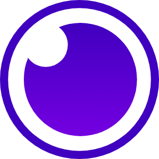

# 👋 Olá! Eu sou o Felipe Souza Moreira

🎯 Desenvolvedor em transição de carreira, apaixonado por tecnologia, automação e soluções inteligentes.  
Atualmente trabalho como **Analista de Teste de Software** e estudo para me tornar **Desenvolvedor Full Stack**.

---

## 🌐 Contato

 

---

## 🧠 Tecnologias que uso no meu dia a dia

  
  
  
  
  
  
  
  

---

## ☁️ Interesses atuais

  
  
  
  
  

---

## 🛠️ Projetos em destaque

- 📚 **[SGPIC - Sistema de Gerenciamento de Projetos Científicos [FrontEnd])](https://github.com/Felpes513/FrontTCC)**  
  Front-end do sistema de gerenciamento acadêmico (Angular + Material Design).

- ⚙️ **[SGPIC - Sistema de Gerenciamento de Projetos Científicos [BackEnd]](https://github.com/Felpes513/UscsTCC)**  
  Back-end em FastAPI + MySQL/MongoDB + RabbitMQ, com arquitetura em camadas.

- 🤖 **[Chatbot de Exames Médicos](https://github.com/Felpes513/chatbot)**  
  Busca de exames com integração a banco MySQL e interface web.

---

🎓 Atualmente curso **Ciência da Computação** na Universidade Municipal de São Caetano do Sul (USCS).  
📘 Estudando para certificações, aprimorar meus conhecimentos e construir valores em minha carreira.  
🚀 Sempre em busca de **novos projetos** que ajudem a crescer como desenvolvedor e solucionar problemas reais com tecnologia.
